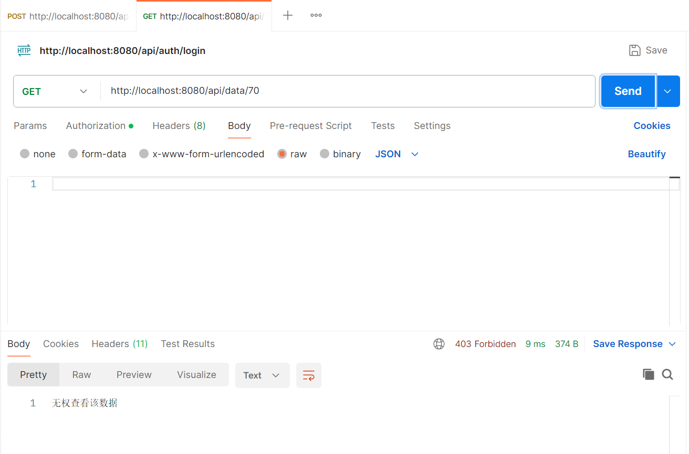
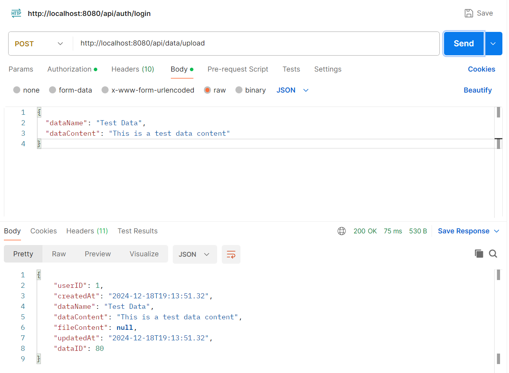
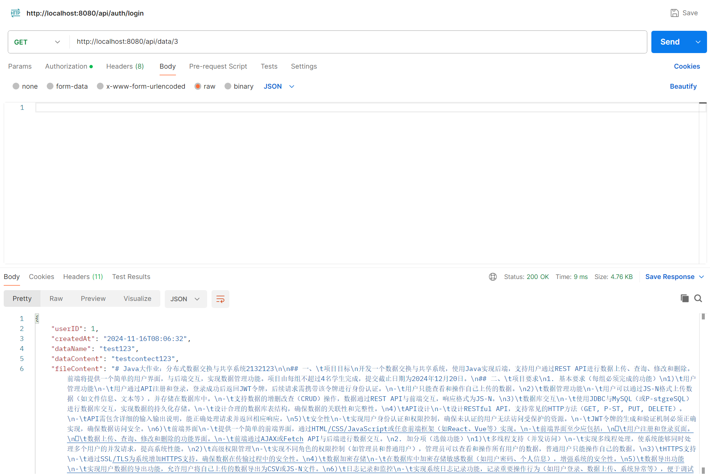
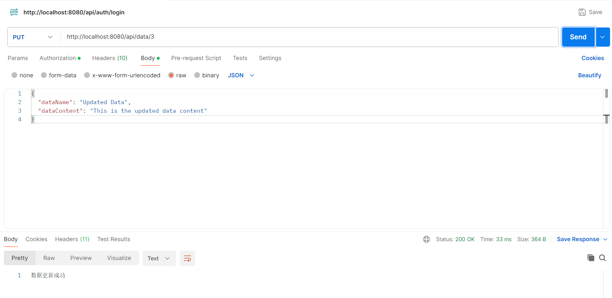
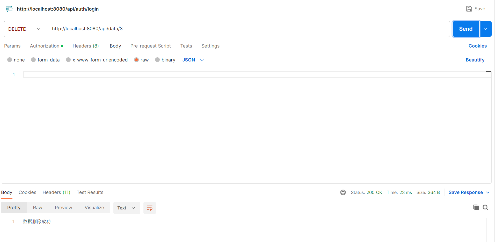

<!-- ## **开发文档** -->
<p align="center">
  
</p>

<div align="center">
  <a href="https://github.com/x1jtb/JavaBigHomework"></a> &ensp;
</div>

<center><a href="https://github.com/cydxf">黄嘉希,</a><a href="https://github.com/xihoubiyouchen">袁宇强,</a><a href="https://github.com/x1jtb">李思昊</a></center>


#### 1. 系统架构

本项目采用前后端分离的架构设计，后端使用Java Spring Boot框架实现RESTful API，前端使用HTML、CSS、JavaScript进行界面开发。系统架构如下：

- **前端**：
  - 使用HTML、CSS、JavaScript构建用户界面，提供用户注册、登录、数据上传、查询、修改和删除等功能。
  - 通过Fetch API与后端进行数据交互，获取和提交数据。

- **后端**：
  - 使用Spring Boot框架实现RESTful API，提供用户管理、数据管理等功能。
  - 使用Spring Security进行用户身份认证和权限控制，使用JWT进行令牌管理。
  - 使用JDBC与MySQL数据库进行交互，实现数据的持久化存储。

- **数据库**：
  - 使用MySQL数据库，存储用户信息和数据信息。
  - 数据库表包括用户表（`users`）和数据表（`data`），通过用户ID进行关联。

- **安全性**：
  - 使用JWT进行用户身份认证，确保只有认证用户才能访问受保护的资源。
  - 使用Spring Security进行权限控制，确保普通用户只能操作自己的数据，管理员可以操作所有用户的数据。

- **并发支持**：
  - 通过Spring Boot的多线程支持，系统能够同时处理多个用户的并发请求，提高系统性能。


---

#### 2. 数据库表结构

##### 用户表（`users`）

| 字段名     | 类型         | 描述               |
|------------|--------------|--------------------|
| id         | BIGINT       | 用户ID（主键）     |
| username   | VARCHAR(255) | 用户名（唯一）     |
| password   | VARCHAR(255) | 密码（加密存储）   |
| role       | VARCHAR(50)  | 用户角色（ADMIN/USER） |

##### 数据表（`data`）

| 字段名        | 类型         | 描述               |
|---------------|--------------|--------------------|
| dataID        | INT          | 数据ID（主键）     |
| userID        | INT          | 用户ID（外键）     |
| dataName      | VARCHAR(255) | 数据名称           |
| dataContent   | TEXT         | 数据内容           |
| fileContent   | TEXT         | 文件内容           |
| createdAt     | DATETIME     | 创建时间           |
| updatedAt     | DATETIME     | 更新时间           |

---

#### 3. API接口说明

##### 3.1 用户管理API

###### 3.1.1 用户注册

- **路径**：`/api/auth/register`
- **HTTP方法**：POST
- **请求参数**：
  - `username`（String）：用户名
  - `password`（String）：密码
- **返回格式**：
  - 成功：`201 Created`，返回`"用户注册成功"`
  - 失败：`400 Bad Request`，返回`"用户名已存在"`

**示例请求**：
```json
{
  "username": "testuser",
  "password": "password123"
}
```

**示例响应**：
```json
"用户注册成功"
```

###### 3.1.2 用户登录

- **路径**：`/api/auth/login`
- **HTTP方法**：POST
- **请求参数**：
  - `username`（String）：用户名
  - `password`（String）：密码
- **返回格式**：
  - 成功：`200 OK`，返回JWT令牌和跳转URL
  - 失败：`401 Unauthorized`，返回`"用户名或密码错误"`

**示例请求**：
```json
{
  "username": "testuser",
  "password": "password123"
}
```

**示例响应**：
```json
{
  "jwt": "eyJhbGciOiJIUzI1NiIsInR5cCI6IkpXVCJ9...",
  "redirectUrl": "/data-management.html"
}
```

###### 3.1.3 管理员认证

- **路径**：`/api/auth/authority/admin`
- **HTTP方法**：POST
- **请求参数**：
  - 无

- **返回格式**：
  - `200 OK`，返回`"管理员认证成功"`


**示例请求**：
```json
{}
```

**示例响应**：
```json
"管理员认证成功"
```

###### 3.1.4 用户认证

- **路径**：`/api/auth/authority/user`
- **HTTP方法**：POST
- **请求参数**：
  - 无

- **返回格式**：
  - `200 OK`，返回`"用户认证成功!"`

**示例请求**：
```json
{}
```

**示例响应**：
```json
"用户认证成功!"
```

###### 3.1.5 获取所有用户

- **路径**：`/api/auth/admin/getusers`
- **HTTP方法**：GET
- **请求参数**：
  - 无
- **返回格式**：
  - 成功：`200 OK`，返回用户列表，包含用户ID和用户名
  - 失败：无（如果没有用户，返回空列表）

**示例请求**：
```
GET /api/auth/admin/getusers
```

**示例响应**：
```json
[
  {
    "id": 1,
    "username": "admin"
  },
  {
    "id": 2,
    "username": "admin1"
  }
]
```

###### 3.1.6 修改用户名

- **路径**：`/api/auth/admin/{id}`
- **HTTP方法**：POST
- **请求参数**：
  - `id`（Long）：用户ID（路径参数）
  - `username`（String）：新的用户名（请求体参数）

- **返回格式**：
  - 成功：`200 OK`，返回`"用户名已更新"`
  - 失败：`400 Bad Request`，返回`"用户名已存在，请选择其他用户名"`
  - 失败：`404 Not Found`, 返回`"用户不存在"`

**示例请求**：
```json
{
  "username": "newUsername"
}
```

**示例响应**：
```json
"用户名已更新"
```

###### 3.1.7 获取用户详细信息

- **路径**：`/api/auth/admin/{userId}/details`
- **HTTP方法**：GET
- **请求参数**：
  - `userId` （Long）：用户ID（路径参数）
- **返回格式**：
  - 成功：`200 OK`，返回用户详细信息，包括用户ID、用户名、密码和用户数据
  - 失败：`404 Not Found`, 返回`"用户不存在"`

**示例请求**：
```
GET /api/auth/admin/{userId}/details
```

**示例响应**：
```json
{
  "id": 1,
  "username": "admin",
  "password": "$2a$10$...",
  "data": [
    {
      "id": 1,
      "userId": 1,
      "content": "数据内容1"
    },
    {
      "id": 2,
      "userId": 1,
      "content": "数据内容2"
    }
  ]
}
```

###### 3.1.8 删除用户

- **路径**：`/api/auth/admin/{id}`
- **HTTP方法**：DELETE
- **请求参数**：
  - `id`（Long）：用户ID（路径参数）

- **返回格式**：
  - 成功：`200 OK`，返回`"用户及其关联数据已删除"`
  - 失败：`400 Bad Request`，返回`"无法删除管理员用户"`
  - 失败：`404 Not Found`, 返回`"用户不存在"`

**示例请求**：
```
DELETE /api/auth/admin/{id}
```

**示例响应**：
```json
"用户及其关联数据已删除"
```

###### 3.1.9 删除用户数据

- **路径**：`/api/auth/admin/{id}/data`
- **HTTP方法**：DELETE
- **请求参数**：
  - `id`（Long）：用户ID（路径参数）

- **返回格式**：
  - 成功：`200 OK`，返回`"用户数据已删除"`
  - 失败：`400 Bad Request`，返回`"无法删除管理员用户的数据"`
  - 失败：`404 Not Found`, 返回`"用户不存在"`

**示例请求**：
```
DELETE /api/auth/admin/{id}/data
```

**示例响应**：
```json
"用户及其关联数据已删除"
```
###### 3.1.10 删除用户数据

- **路径**：`/api/auth/admin/{userId}/reset-password`
- **HTTP方法**：POST
- **请求参数**：
  - `userId`（Long）：用户ID（路径参数）

- **返回格式**：
  - 成功：`200 OK`，返回`"密码已重置为 123456"`
  - 失败：`404 Not Found`，返回`"用户不存在"`


**示例请求**：
```json
{}
```

**示例响应**：
```json
"密码已重置为 123456"
```

##### 3.2 数据管理API

###### 3.2.1 上传数据

- **路径**：`/api/data/upload`
- **HTTP方法**：POST
- **请求参数**：
  - `dataName`（String）：数据名称
  - `dataContent`（String）：数据内容
  - `fileContent`（String）：文件内容（可选）
- **返回格式**：
  - 成功：`200 OK`，返回上传的数据
  - 失败：`400 Bad Request`，返回错误信息

**示例请求**：
```json
{
  "dataName": "Test Data",
  "dataContent": "This is a test data content"
}
```

**示例响应**：
```json
{
  "dataID": 1,
  "userID": 1,
  "dataName": "Test Data",
  "dataContent": "This is a test data content",
  "createdAt": "2023-10-01T12:00:00",
  "updatedAt": "2023-10-01T12:00:00"
}
```

###### 3.2.2 查询数据

- **路径**：`/api/data/{dataID}`
- **HTTP方法**：GET
- **请求参数**：
  - `dataID`（String）：数据ID
- **返回格式**：
  - 成功：`200 OK`，返回查询的数据
  - 失败：`404 Not Found`，返回`"数据未找到"`

**示例请求**：
```
GET /api/data/1
```

**示例响应**：
```json
{
  "dataID": 1,
  "userID": 1,
  "dataName": "Test Data",
  "dataContent": "This is a test data content",
  "createdAt": "2023-10-01T12:00:00",
  "updatedAt": "2023-10-01T12:00:00"
}
```

###### 3.2.3 修改数据

- **路径**：`/api/data/{dataID}`
- **HTTP方法**：PUT
- **请求参数**：
  - `dataName`（String）：数据名称
  - `dataContent`（String）：数据内容
  - `fileContent`（String）：文件内容（可选）
- **返回格式**：
  - 成功：`200 OK`，返回`"数据更新成功"`
  - 失败：`404 Not Found`，返回`"数据未找到"`

**示例请求**：
```json
{
  "dataName": "Updated Data",
  "dataContent": "This is the updated data content"
}
```

**示例响应**：
```json
"数据更新成功"
```

###### 3.2.4 删除数据

- **路径**：`/api/data/{dataID}`
- **HTTP方法**：DELETE
- **请求参数**：
  - `dataID`（String）：数据ID
- **返回格式**：
  - 成功：`200 OK`，返回`"数据删除成功"`
  - 失败：`404 Not Found`，返回`"数据未找到"`

**示例请求**：
```
DELETE /api/data/1
```

**示例响应**：
```json
"数据删除成功"
```

###### 3.2.5 获取所有数据

- **路径**：`/api/data/all`
- **HTTP方法**：GET
- **请求参数**：
  - 无
- **返回格式**：
  - 成功：`200 OK`，返回数据列表
  - 失败：`500 Internal Server Error`，返回错误信息

**示例请求**：
```
GET /api/data/all
```

**示例响应**：
```json
[
  {
    "dataID": 1,
    "userID": 1,
    "dataName": "Test Data",
    "dataContent": "This is a test data content",
    "createdAt": "2023-10-01T12:00:00",
    "updatedAt": "2023-10-01T12:00:00"
  },
  {
    "dataID": 2,
    "userID": 1,
    "dataName": "Another Data",
    "dataContent": "Content for another data",
    "createdAt": "2023-10-02T14:30:00",
    "updatedAt": "2023-10-02T14:30:00"
  }
]
```
###### 3.2.6 获取用户数据

- **路径**：`/api/data/admin/{userId}/data`
- **HTTP方法**：GET
- **请求参数**：
  - `userId` （Long）：用户ID（路径参数）
- **返回格式**：
  - 成功：`200 OK`，返回数据列表
  - 失败：`404 Not Found`，返回`"用户不存在"`

**示例请求**：
```
GET /api/data/admin/1/data
```

**示例响应**：
```json
[
  {
    "dataID": 1,
    "userID": 1,
    "dataName": "Test Data",
    "dataContent": "This is a test data content",
    "createdAt": "2023-10-01T12:00:00",
    "updatedAt": "2023-10-01T12:00:00"
  }
]
```

###### 3.2.7 获取用户数据

- **路径**：`/api/data/admin/{dataID}`
- **HTTP方法**：PUT
- **请求参数**：
  - `dataID` （Long）：数据ID（路径参数）
  - `dataName` （String）：数据名称（请求体参数）
  - `dataContent` （String）：数据内容（请求体参数）
- **返回格式**：
  - 成功：`200 OK`，返回`"数据已更新"`
  - 失败：`404 Not Found`，返回`"数据不存在"`

**示例请求**：
```json
{
  "dataName": "Updated Data Name",
  "dataContent": "Updated data content"
}
```

**示例响应**：
```json
"数据已更新"
```
###### 3.2.8 删除用户数据

- **路径**：`/api/data/admin/{dataID}`
- **HTTP方法**：PUT
- **请求参数**：
  - `dataID` （Long）：数据ID（路径参数）

- **返回格式**：
  - 成功：`200 OK`，返回`"数据已删除"`
  - 失败：`404 Not Found`，返回`"数据不存在"`

**示例请求**：
```
DELETE /api/data/admin/1
```

**示例响应**：
```json
"数据已删除"
```

---

#### 4. 测试报告

##### 4.1 用户管理功能测试

- **测试内容**：
  - 用户注册、登录、权限控制。
- **测试结果**：
  - 用户注册成功，用户名唯一性验证通过。
  - 
  - 用户登录成功，JWT令牌生成正确。
  - 
  - 未认证用户无法访问受保护的资源。
  - 

##### 4.2 数据管理功能测试

- **测试内容**：
  - 数据上传、查询、修改、删除。
- **测试结果**：
  - 数据上传成功，数据存储正确。
  - 
  - 数据查询成功，返回数据正确。
  - 
  - 数据修改成功，数据更新正确。
  - 
  - 数据删除成功，数据从数据库中移除。
  - 

##### 4.3 并发访问测试

- **测试内容**：
  - 使用多线程模拟并发请求。使用JMeter进行并发测试，10秒10线程，每个线程发送50个请求。
- **测试结果**：
  - 系统能够同时处理多个用户的并发请求，出错率为0，平均响应时间为163毫秒，性能良好。  
-   | #Samples | Average | Min   | Max.    | Std. Dev. | Error % | Throughput | Received KB/sec | Sent KB/sec | Avg. Bytes |
    |----------|---------|-------|---------|-----------|---------|------------|-----------------|-------------|------------|
    | 500     | 163    | 93   | 754  | 113.20   | 0.00%   | 49.3/sec   | 25.24           | 11.71       | 524.0      |

##### 4.4 安全性测试

- **测试内容**：
  - JWT令牌验证、权限控制。
- **测试结果**：
  - JWT令牌验证通过，未认证用户无法访问受保护的资源。
  - 权限控制正确，普通用户只能操作自己的数据，管理员可以操作所有用户的数据。

#### 5.各成员的贡献
- **黄嘉希**：
  - 美化前端界面：调整样式、添加图片
  - 实现登录功能
  - 实现用户登录成功跳转至数据管理界面
  - 实现数据的创建和修改时间的显示
  - 实现批量上传文件功能
  - 实现查找数据功能
  - 实现文件数据的修改功能
  - 实现管理员查看并操作所有用户数据的功能
  - 并发访问和API测试
  - 撰写文档

- **袁宇强**：
  - 设计API和数据库
  - 实现注册功能
  - 实现管理员与用户的身份验证功能
  - 实现数据的上传、删除以及文本数据的修改功能
  - 实现数据的导出及批量导出功能
  - 实现管理员修改用户名、下载用户信息、删除用户、删除用户数、重置密码功能

- **李思昊**：
  - 搭建前端界面
  


#### 6.遇到的问题及解决方式
##### 6.1.1 Maven项目构建失败
在构建Maven项目时报错，说什么缺失SprintBoot依赖，但是明明在pom.xml已经写了相应依赖，最后发现不仅要指定依赖，还要写清除版本，因为这个IDEA没有这么智能，你不写清楚版本它就不知道。但是依赖配好之后还是报错，发现是因为文件结构不符合Maven项目的结构，调整之后就构建成功了。

##### 6.1.2 登录时403报错
我们在写好了登录的逻辑之后，尝试登录出现403报错，而控制台没有输出任何报错信息。这时，尝试使用Postman进行测试，依旧是403，但此时在控制台输出了报错，是数据库没有相应信息，确实，数据库是空的。然后在数据库里新建了一个用户，再尝试登录，成功。

##### 6.1.3 antMatchers权限认证问题
在实现权限认证时，需要注意`antMathcers`的顺序问题，需要权限的要在放行所有的前面，否则原本需要权限认证的api也会被放行。
错误：下面的两行权限认证无效

正确：


##### 6.1.4 依赖项dataRepository未注入
在`DataController`中实现查询所有数据的api中发现运行报错，查找后发现是由于未对`dataRepository`进行注入

注入后：


##### 6.1.5 类要求命名与数据库字段命名规范不一致
在调用`dataRepository.findByUserID()`这个方法时出现了报错 
```log
Unable to locate Attribute  with the the given name [userID] on this ManagedType [com.example.entity.Data]
```
阅读后发现是无法在`data`类中找到`userID`字段，而`data`类中所有的都是大写字母开头的字段，再查阅文献后发现要将data类中的UserID改为userID才能解决。
问题出现原因：实体类字段命名问题，应当符合驼峰规则（即首字母小写，后续单词首字母大写），否则JPA查询时，无法找到对应字段。
文献链接：https://blog.csdn.net/qq_43598179/article/details/111583054

##### 6.1.6 api接受的id字符类型不符合需要
在后端中`DataController`中的api实现时，由于从前端传进来的id为`string`类型，与数据库操作要求的`integer`类型不符，导致无法正常运行。我们采用`Integer.parseInt()`方法，对id类型进行转换。

##### 6.1.7 Data和User类中get和set方法过于冗杂
在建立与数据库字段相对应的变量时，同时需要定义它们的`set`和`get`方法，由于变量较多，对应所定义的方法也十分地多，显得类中定义十分得多，冗杂，不利于后续查看。故使用`@Setter`和`@Getter`注解对定义简化

注解前需要多写的代码：


注解后只需两行：


##### 6.1.8 上传数据后自动刷新异常
在`data-management`页面即数据管理界面中，用户在成功上传数据后，数据表单刷新后无法显示新增数据，控制台报错：
```log
Uncaught (in promise) TypeError: Cannot read properties of undefined (reading 'forEach')
```
查找相关代码后发现是由于未向其传入任何参数却又调用了`renderDataList()`使其`renderDataList()`下的一个参数未定义，导致控制台报错。而其实`fetchALLData()`获取所有数据的函数中已经包含了渲染数据列表的函数了，故只需删除`renderDataLis()`并再`fetchALLData()`前面添加一个等待所有数据上传完毕的方法，即可实现上传数据后表单自动刷新出新增数据。

修改前：


修改后：


##### 6.1.9 美化界面时发现添加按钮的样式后按钮失去了功能
给按钮加上了样式之后，发现按钮失去了原本的功能。检查代码后发现是前端的元素的id和后端的元素的id不一致，也就是样式的按钮id和功能的按钮id不一样，样式的id是`btn-primary`，而功能的按钮id是`edit-btn`，将两者统一后问题解决。

##### 6.1.10 图片未能居中显示
“分布式数据交换与共享系统”这个标题其实是张图片，我们设置了这个图片居中显示，但是发现依旧没有居中：


最后更改了这张图片的最大宽度成功居中


##### 6.1.11 无需管理员权限即可查看所有用户数据
在进行API测试时，我们发现，在没有进行登录的情况下居然可以通过管理员的API调取到所有的用户数据。发现是新增管理员API后没有配置相应的权限要求，补上之后就OK了。